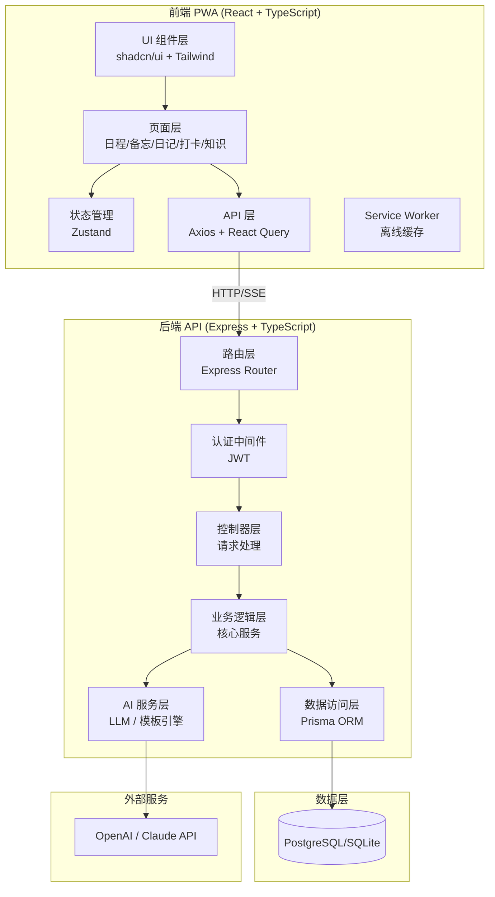

# JifyLife 产品需求文档（PRD）

> **Slogan: P人也能变J人** 🦀
>
> JifyLife = J-ify + Life，让你的生活 J 化——用工具赋予 P 人 J 人的条理与执行力。

---

## 1. 产品概述

JifyLife 是一款跨平台个人效率管理工具，以 PWA 形式提供服务，用户可在手机浏览器中添加到桌面获得接近原生的体验，同时在电脑端浏览器中无缝使用，数据通过云端实时同步。

产品面向个人用户，未来可能开放给更多人使用，因此需要完整的用户认证体系。产品同时提供 **AI 智能模式**和**模板规则模式**，用户可自由切换。

### 1.1 目标用户画像

- **核心用户**：P 型人格（MBTI 中的 Perceiving），日常生活随性、缺乏规划
- **痛点**：想变得有条理但缺乏工具支持，传统效率工具门槛高、过于严肃
- **期望**：轻松记录、智能整理、无压力地建立好习惯

### 1.2 产品定位

不是又一个严肃的 GTD 工具，而是一个**温和的生活整理助手**——你只管随手记录，JifyLife 帮你理清思路、生成日记、发现值得坚持的好习惯。

---

## 2. 核心功能

### 2.1 日程管理

- 支持日程的创建、编辑、删除
- 提供日历视图（月/周/日）和列表视图
- 支持日程提醒、重复日程、日程分类与颜色标记

### 2.2 备忘录

- 快速创建文本备忘，支持富文本编辑
- 分类/标签管理，全文搜索
- 置顶和归档

### 2.3 流水账日记生成

- 用户随时记录碎片化的流水账条目（时间 + 内容）
- 系统将当天流水账整合生成结构化日记
- 提供 **AI 智能润色生成模式**和**模板拼接生成模式**两种方式
- 用户可预览编辑后保存

### 2.4 打卡点提炼

- 从用户的日常记录（流水账、日记、备忘）中自动或手动提炼出值得持续关注的打卡项（如习惯、地点、活动）
- 支持打卡记录与统计
- 展示连续打卡天数和完成率

### 2.5 知识整理

- 知识卡片的收集与管理
- 支持标签体系和多级分类
- 卡片之间可建立关联
- 支持全文检索和按标签聚合浏览

### 2.6 统一输入与语音交互

- **单窗口架构**：整个应用只有一个主窗口，所有记录通过统一的输入框完成，AI 自动识别意图并归类（日程/备忘/流水账/打卡/知识）
- **语音优先**：支持语音输入作为主要交互方式，基于 Web Speech API（主方案）和 Whisper API（降级方案）
- **实时转写**：语音录制时实时显示转写结果，用户可编辑后发送
- **智能指令识别**：AI 解析语音/文字中的时间、动作、意图，自动创建对应类型的记录
- **时间线展示**：所有记录按时间倒序排列在统一的卡片流中，按类型以颜色和图标区分

> 详见 [UI 设计方案](./UI-DESIGN.md)

### 2.7 用户系统

- 注册/登录（邮箱 + 密码）
- JWT 认证
- 用户个人设置（AI 模式开关、主题偏好等）

### 2.8 数据同步

- 所有数据通过云端 API 同步，支持多端实时一致

---

## 3. 技术架构

### 3.1 前端

- **框架**：React 18 + TypeScript
- **构建工具**：Vite 5
- **样式**：Tailwind CSS 4
- **UI 组件库**：shadcn/ui（美观、可定制、轻量）
- **PWA 支持**：vite-plugin-pwa（Service Worker、离线缓存、安装提示）
- **路由**：React Router v6
- **状态管理**：Zustand（轻量、简洁）
- **HTTP 请求**：Axios + React Query（缓存、自动重试、乐观更新）
- **日历组件**：react-big-calendar 或自建
- **富文本编辑**：Tiptap（轻量、可扩展）
- **图表统计**：Recharts（打卡统计可视化）

### 3.2 后端

- **运行时**：Node.js 20+
- **框架**：Express.js + TypeScript
- **ORM**：Prisma（类型安全、迁移管理方便）
- **数据库**：SQLite（开发阶段）/ PostgreSQL（生产阶段），Prisma 无缝切换
- **认证**：JWT（access token + refresh token）
- **AI 接入**：OpenAI / Claude API，通过统一的 AI Service 层封装，支持模型切换
- **校验**：Zod（请求参数校验，前后端共享类型）

### 3.3 项目组织

- **Monorepo 结构**：使用 pnpm workspace，前后端共享类型定义
- **共享包**：`packages/shared` 存放前后端通用的类型、常量、校验规则

---

## 4. 架构设计



---

## 5. 实现方案

采用前后端分离的 Monorepo 架构，前端为 React PWA 应用，后端为 RESTful API 服务。数据通过云端 API 同步，前端使用 React Query 做请求缓存和乐观更新以保证响应速度。PWA 的 Service Worker 提供离线基础缓存，保证弱网环境下核心页面可访问。

AI 能力通过后端统一的 AI Service 层封装，前端通过 API 调用，用户在设置中可切换 AI/模板模式。后端 AI Service 使用策略模式，根据用户选择调用 LLM API 或模板引擎。

### 5.1 关键技术决策

1. **Monorepo（pnpm workspace）**：前后端类型共享，减少重复定义和不一致风险，统一构建流程
2. **Prisma + SQLite/PostgreSQL**：开发用 SQLite 零配置启动，生产切 PostgreSQL，Prisma schema 一致，迁移平滑
3. **React Query**：自动缓存、后台刷新、乐观更新，让多端数据同步体验流畅
4. **Zustand 而非 Redux**：项目规模适中，Zustand 更轻量直觉，减少样板代码
5. **shadcn/ui**：组件代码直接拷贝到项目中，完全可控可定制，配合 Tailwind 效果极佳
6. **Tiptap 编辑器**：相比 Slate.js 更易上手，插件生态好，适合备忘和知识卡片的富文本需求

---

## 6. 实现注意事项

- **PWA 配置**：需配置 manifest.json（图标、主题色、启动画面）和 Service Worker 缓存策略（App Shell + Runtime Caching）
- **响应式设计**：所有页面必须同时适配移动端（375px-428px）和桌面端（1024px+），使用 Tailwind 断点系统
- **API 设计**：RESTful 风格，统一响应格式 `{ code, data, message }`，统一错误处理中间件
- **安全**：密码 bcrypt 加盐哈希，JWT 双 token 机制（access 15min / refresh 7d），API 限流
- **AI 调用**：设置超时和重试机制，流式输出支持（SSE），避免长时间阻塞用户
- **性能**：列表页分页加载，日历视图按月懒加载数据，图片/附件压缩上传

---

## 7. 关键数据类型

### 7.1 流水账与日记

```typescript
export type GenerateMode = 'ai' | 'template';

export interface FlowEntry {
  id: string;
  userId: string;
  content: string;
  timestamp: string;       // ISO 时间字符串
  tags?: string[];
  createdAt: string;
}

export interface Journal {
  id: string;
  userId: string;
  date: string;            // YYYY-MM-DD
  title: string;
  content: string;         // 生成的日记正文（Markdown）
  flowEntryIds: string[];  // 关联的流水账条目
  generateMode: GenerateMode;
  createdAt: string;
  updatedAt: string;
}

export interface JournalGenerateRequest {
  date: string;
  mode: GenerateMode;
  flowEntryIds?: string[]; // 不传则使用当天所有条目
}
```

### 7.2 AI 服务接口

```typescript
export interface AIProvider {
  generateJournal(entries: FlowEntry[], options?: GenerateOptions): Promise<string> | AsyncGenerator<string>;
  extractCheckinPoints(entries: FlowEntry[]): Promise<CheckinSuggestion[]>;
}

export interface GenerateOptions {
  style?: 'casual' | 'formal' | 'literary';
  stream?: boolean;
}

export interface CheckinSuggestion {
  name: string;
  category: 'habit' | 'place' | 'activity';
  reason: string;
  frequency: string;
}
```

---

## 8. 设计风格

采用现代简约风格，融合 Glassmorphism 毛玻璃质感和柔和渐变，打造清新、专注的效率工具体验。整体以浅色为主基调，配合淡蓝紫渐变作为品牌色，营造宁静而富有层次感的视觉效果。

### 8.1 界面设计理念

JifyLife 采用**单窗口架构**，摒弃传统效率工具的多页面多 Tab 导航模式。整个应用只有一个主视图：顶部是品牌栏，中间是时间线卡片流，底部是统一输入框（支持文字和语音）。日记回顾、打卡统计、知识库等辅助功能以 Bottom Sheet 或 Overlay 形式浮现在主界面之上，用完即关，不打断用户的主流程。

这一设计服务于 P 人用户的核心诉求——**不要让我选择，让我直接说**。语音输入是第一公民，文字输入是可靠的备选。

> 完整的 UI 设计方案、交互流程和组件规范见 [UI 设计方案](./UI-DESIGN.md)

### 8.2 设计规范

- **圆角系统**：卡片圆角 16px，按钮圆角 12px，输入框圆角 10px
- **阴影层次**：三级阴影体系——浅影（卡片）、中影（弹窗）、深影（浮层）
- **间距系统**：基于 4px 网格，主间距 16px/24px/32px
- **动效**：页面切换淡入淡出 200ms，列表项入场交错动画，按钮 hover 微缩放，下拉刷新回弹效果
- **响应式断点**：移动端 < 768px，桌面端 ≥ 1024px

---

## 9. 目录结构

```
JifyLife/                                # 项目根目录
├── package.json                         # Monorepo 根配置
├── pnpm-workspace.yaml                  # pnpm workspace 配置
├── tsconfig.base.json                   # TypeScript 基础配置
├── .gitignore                           # Git 忽略规则
├── .env.example                         # 环境变量模板
├── README.md                            # 项目说明文档
├── docs/                                # 产品文档目录
│   └── PRD.md                           # 本文档
│
├── packages/
│   └── shared/                          # 前后端共享包
│       ├── package.json
│       ├── tsconfig.json
│       └── src/
│           ├── types/                   # 共享类型定义
│           ├── constants/               # 共享常量
│           └── validators/              # Zod 校验规则
│
├── apps/
│   ├── web/                             # 前端 PWA 应用
│   │   ├── public/                      # 静态资源（PWA manifest、图标）
│   │   └── src/
│   │       ├── components/              # UI 组件
│   │       ├── pages/                   # 页面组件
│   │       ├── hooks/                   # 自定义 Hooks
│   │       ├── stores/                  # Zustand 状态管理
│   │       ├── services/                # API 服务层
│   │       └── styles/                  # 全局样式
│   │
│   └── server/                          # 后端 API 服务
│       ├── prisma/                      # Prisma 数据模型
│       └── src/
│           ├── config/                  # 配置管理
│           ├── middleware/              # 中间件
│           ├── routes/                  # 路由
│           ├── controllers/             # 控制器
│           ├── services/                # 业务逻辑层
│           │   └── ai/                  # AI 服务
│           └── utils/                   # 工具函数
```
